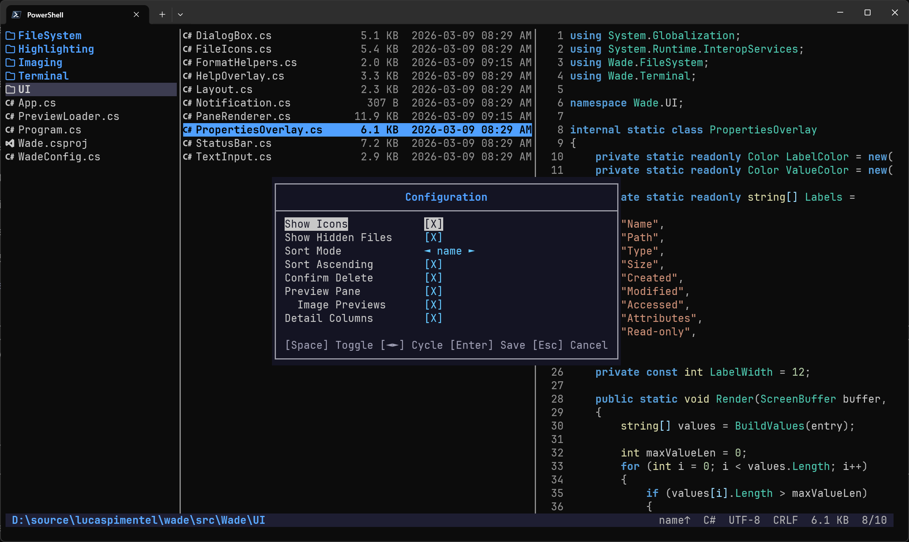

# wade

[](https://github.com/lucaspimentel/wade/actions/workflows/ci.yml) [](https://github.com/lucaspimentel/wade/actions/workflows/release.yml)

A terminal file browser with Miller columns, written in C#.

Pre-built binaries support Windows and Linux. macOS is supported when built from source.

Inspired by [yazi](https://github.com/sxyazi/yazi), [broot](https://github.com/Canop/broot), and [ranger](https://github.com/ranger/ranger).



## Features

- **Miller columns** — three-pane layout: parent / current directory / preview; preview pane can be hidden for a 2-pane layout via `preview_pane_enabled` config
- **File-type icons** — Nerd Fonts v3 glyphs per file extension (enabled by default; requires a Nerd Font)
- **Syntax highlighting** — per-token coloring for common languages using a hand-rolled tokenizer; VS Code Dark+ inspired palette
- **File preview** — displays first 100 lines of text files; binary files show an xxd-style hex dump with colored offset, hex bytes, and ASCII columns (toggle with `hex_preview_enabled` config, default: on); zip-format archives (`.zip`, `.nupkg`, `.jar`, `.war`, `.ear`) show a content listing with entry names and sizes (toggle with `zip_preview_enabled` config, default: on)
- **Image preview** — renders image thumbnails in the preview pane using Sixel graphics (auto-detects Sixel support; works with Windows Terminal v1.22+, kitty, WezTerm, and other Sixel-capable terminals; enabled by default; disable with `image_previews_enabled = false` in config)
- **Expanded preview** — press Right/Enter on a file to expand the preview to full terminal width; scroll with Up/Down/J/K/PageUp/PageDown/Home/End/mouse wheel; press Left/Escape to collapse back to 3-pane view
- **Directory preview** — shows contents of the selected directory
- **Drive navigation** — browse across drives on Windows (Backspace from a drive root)
- **Detail columns** — file size and modification date in the center pane; each column toggleable independently via `size_column_enabled` / `date_column_enabled` config; columns adapt responsively as the terminal narrows (full date → date only → short date → size only → name only)
- **Status bar** — current path, item count, file type label (language name, "Text", or "Binary"), encoding (UTF-8, UTF-8 BOM, UTF-16 LE/BE), line endings (CRLF, LF, CR, Mixed), file size, and sort indicator
- **Hidden files toggle** — dotfiles and system-hidden files are hidden by default; press `.` to toggle visibility at runtime, or set `show_hidden_files = true` in config; on Windows, system files (e.g. `$Recycle.Bin`) can be shown separately via `show_system_files = true` in config
- **Sort order** — sort by name (default), modification time, size, or extension; press `s` to cycle modes, `S` to reverse direction; directories always listed first; configurable via `sort_mode` and `sort_ascending` in config; current sort mode shown in status bar
- **Go-to-path bar** — press `g` to type an arbitrary path and jump to it; Tab auto-completes from the filesystem; navigates to directories or selects files
- **Search / filter** — press `/` to type a query that narrows visible entries in real-time; Enter persists the filter, Escape clears it; filter auto-clears on directory change
- **Multi-select** — press Space to mark/unmark entries for future bulk operations; marks are path-based and survive scrolling and filtering; marked entries highlighted with a distinct background; mark count shown in status bar
- **Symlink awareness** — symlinks shown with dedicated icons, cyan text, and ` → target` suffix; broken symlinks highlighted in red
- **Symlink creation** — press `Ctrl+L` to create a symbolic link to the selected item; prompts for the link name
- **File actions** — open files with default app, rename, delete (with optional confirmation), copy/cut/paste with OS clipboard interop (files copied in wade can be pasted in Explorer and vice versa; Windows only); multi-select supported for delete/copy/cut; delete confirmation can be toggled via `confirm_delete_enabled` config
- **Copy path to clipboard** — press `y` to copy the selected item's absolute path to the OS clipboard; press `Y` to copy the path relative to the git repo root (shows an error if not inside a git repo); works in both normal view and expanded preview mode
- **Mouse support** — click to select entries in any pane, scroll wheel to navigate; left/right pane clicks navigate directories
- **File properties** — press `i` to open a properties overlay showing detailed metadata: name, full path, type (with symlink-aware labels like "Symlink → File"), link target, formatted size with raw bytes (directories calculate size asynchronously), created/modified/accessed timestamps, file attributes, and read-only status
- **Glow markdown preview** — renders markdown files using the [glow](https://github.com/charmbracelet/glow) CLI for rich preview with styled headings, lists, code blocks, etc. (requires `glow` on PATH; disabled by default; enable with `glow_markdown_preview_enabled = true` in config or toggle in config dialog)
- **In-app configuration** — press `,` to open a config dialog with toggleable options: icons, hidden files, system files (Windows), sort mode, sort direction, delete confirmation, preview pane, image previews, glow preview, zip preview, hex preview, size column, date column, copy-symlinks-as-links, and terminal title; changes are saved directly to the config file
- **Bookmarks** — press `b` to open a filterable bookmarks dialog; press `B` to toggle the current directory as a bookmark; quick-jump with `1`-`9`, `Enter` to navigate, `d`/`Delete` to remove; bookmarks persist to `~/.config/wade/bookmarks` in MRU order
- **File finder** — press `Ctrl+F` to recursively search for files by name in the current directory tree; type to filter, Up/Down to navigate, Enter to open the file
- **Action palette** — press `Ctrl+P` to open a searchable action palette listing all available commands; type to filter, Up/Down to navigate, Enter to execute
- **Shell integration** — press `Ctrl+T` to open a new terminal in the current directory; use shell wrapper functions (`wd`) to cd to the final directory on exit (bash, zsh, fish, PowerShell wrappers provided)
- **Terminal title** — sets the terminal tab title to the current directory; uses xterm title stack to restore the original title on exit (toggle with `terminal_title_enabled` config, default: on)
- **Minimal rendering** — raw VT/ANSI escape sequences, double-buffered with dirty-row tracking, cell diff, and style diffing

## Requirements

- A terminal with VT/ANSI support (Windows Terminal, ConPTY-based terminals, or Unix/WSL terminals)

## Installation

### Scoop (Windows)

```powershell
scoop bucket add lucaspimentel https://github.com/lucaspimentel/scoop-bucket
scoop install wade
```

### From GitHub releases (no build tools needed)

```powershell
./install-remote.ps1
```

Or as a one-liner:

```powershell
irm https://raw.githubusercontent.com/lucaspimentel/wade/main/install-remote.ps1 | iex
```

### From source

Requires [.NET 10 SDK](https://dotnet.microsoft.com/download/dotnet/10.0).

```powershell
./install-local.ps1
```

Both scripts install to `~/.local/bin/wade`. Ensure that directory is in your `PATH`.

## Usage

```bash
wade              # open in current directory
wade C:\Users     # open in a specific directory
```

## Configuration

### Config file

`~/.config/wade/config.toml`

```toml
show_icons_enabled = true
image_previews_enabled = true
glow_markdown_preview_enabled = false
show_hidden_files = false
show_system_files = false       # Windows only; requires show_hidden_files
sort_mode = name                # name, modified, size, extension
sort_ascending = true
confirm_delete_enabled = true
preview_pane_enabled = true
size_column_enabled = true
date_column_enabled = true
copy_symlinks_as_links_enabled = true
zip_preview_enabled = true
hex_preview_enabled = true
terminal_title_enabled = true
```

### CLI flags

```bash
wade --show-config                    # print current config as JSON and exit
wade --config-file=/path/to/config    # use a custom config file
wade --help                           # print usage info and exit
wade -h                               # same as --help
```

## Shell integration (cd on exit)

Wade can change your shell's working directory when you quit with `q`. Source the appropriate wrapper function in your shell config:

**Bash / Zsh** — add to `~/.bashrc` or `~/.zshrc`:
```bash
source /path/to/wade/shell/wd.sh
```

**Fish** — copy to `~/.config/fish/functions/` or source in `config.fish`:
```fish
source /path/to/wade/shell/wd.fish
```

**PowerShell** — add to your `$PROFILE`:
```powershell
. /path/to/wade/shell/wd.ps1
```

Then use `wd` instead of `wade` to browse. Press `q` to quit and cd to the last directory, or `Q` to quit without changing directory.

## Keybindings

| Key | Action |
|---|---|
| Up / k | Move selection up |
| Down / j | Move selection down |
| Right / l / Enter | Open directory / expand preview |
| Left / h / Backspace | Go back / collapse preview |
| Page Up / Page Down | Scroll by page |
| Home / End | Jump to first / last item |
| Left Click | Select / Open |
| Scroll | Navigate up/down |
| Ctrl+R | Refresh |
| Ctrl+T | Open terminal here |
| . | Toggle hidden files |
| s | Cycle sort (name / time / size / ext) |
| S | Reverse sort direction |
| g | Go to path (Esc clears input, Up goes up a directory) |
| b | Open bookmarks dialog |
| B | Toggle current directory as bookmark |
| / | Search / filter |
| Esc (in search) | Clear filter |
| Space | Toggle mark (multi-select) |
| o | Open with default app |
| F2 | Rename |
| Del | Delete (Recycle Bin on Windows) |
| Shift+Del | Delete permanently |
| c | Copy |
| x | Cut |
| p / v | Paste |
| y | Copy absolute path to clipboard |
| Y | Copy git-relative path to clipboard |
| n | Create new file |
| Shift+N | Create new directory |
| Ctrl+L | Create symlink to selected item |
| i | Properties |
| , | Configuration |
| Ctrl+F | Find file |
| Ctrl+P | Action palette |
| ? | Show help |
| q / Escape | Quit |
| Q | Quit without cd |

## Building

```bash
dotnet build Wade.slnx
dotnet test Wade.slnx
```

## License

This project is licensed under the [MIT License](LICENSE).

## Development

This project was developed with [Claude Code](https://claude.ai/code) 🤖
